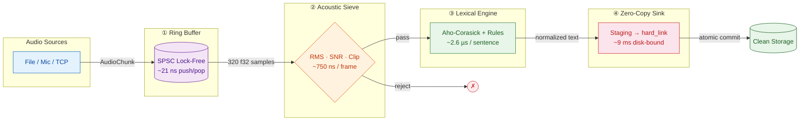

# AeroSieve

**A sub-millisecond, zero-copy audio/text ingestion engine in Rust.**

AeroSieve is a proof-of-work systems project aimed at voice AI infrastructure teams. It ingests paired 20ms audio frames + transcripts from files, microphones, or TCP sockets; rejects silence, noise, and clipped audio with deterministic DSP; normalizes code-mixed Hinglish text through a compiled rule engine; and commits clean pairs to storage with atomic filesystem semantics.

> This repo is not a product. It is a **production-quality demonstration** of low-latency systems design: lock-free queues, zero-allocation hot paths, cross-platform Rust, and statistical benchmarking.

---

## Why this matters

Voice AI companies ingest millions of short audio + transcript pairs. Every millisecond of preprocessing latency and every wasted allocation translates directly into cloud cost and user-perceived lag. Most teams solve this with heavy Python regex and ML VAD models that are slow, opaque, and memory-hungry.

AeroSieve shows the alternative: a deterministic, auditable Rust pipeline that does the same job in **single-digit microseconds** with a **flat memory footprint**.

---

## Architecture



**Why this matters for voice AI** — ElevenLabs-quality voice synthesis starts with clean training data. AeroSieve's acoustic gate deterministically rejects silence, noise, and clipped audio before it reaches storage, while the lexical engine normalizes code-mixed text through compiled rules — no ML overhead, no Python regex bottlenecks, just predictable sub-100µs compute.

| Phase                       | Responsibility                                           | Key Design Choice                                                    |
| :-------------------------- | :------------------------------------------------------- | :------------------------------------------------------------------- |
| **① Ring Buffer**    | Move chunks between producer and consumer without copies | `ringbuf` lock-free SPSC, `AudioChunk` carries `&[f32]` slices |
| **② Acoustic Sieve** | Reject silence, low-SNR, and clipped frames              | Pure math: RMS, SNR against a leading noise window, clip ratio       |
| **③ Lexical Engine** | Normalize Hinglish, currencies, abbreviations            | Aho-Corasick keyword pre-filter + compiled regex rules from YAML     |
| **④ Zero-Copy Sink** | Commit accepted pairs atomically                         | Staging directory +`hard_link` (fallback to `rename`)            |

---

## Performance

All numbers below are produced by `cargo bench --bench pipeline_benchmark` on a standard Windows development laptop. The headline latency and throughput benchmarks use a **null sink** to isolate the compute engine; the file-sink benchmark shows the real disk-limited path.

### Tail Latency Distribution (20ms frame + Hinglish transcript)

| Percentile    | Latency            | Notes                              |
| :------------ | :----------------- | :--------------------------------- |
| P50           | 4.8 µs            | Median end-to-end frame processing |
| P90           | 10.7 µs           |                                    |
| P95           | 11.3 µs           |                                    |
| **P99** | **14.2 µs** | **< 1.0 ms SLA by 70×**     |
| P99.9         | 33.3 µs           |                                    |
| MAX           | 297.9 µs          | Worst-case single sample           |

### Memory Flatline (10,000,000 frames)

| Frames    | RSS     |
| :-------- | :------ |
| 0         | 21.7 MB |
| 500,000   | 25.8 MB |
| 1,000,000 | 25.8 MB |
| ...       | flat    |
| 9,500,000 | 25.8 MB |

A flat line proves zero memory growth in the hot path.

### Throughput Saturation

| Workers | Total FPS | Total Frames |
| :------ | :-------- | :----------- |
| 1       | 331,044   | 1,000,000    |
| 2       | 481,982   | 1,000,000    |
| 4       | 787,286   | 1,000,000    |
| 8       | 969,871   | 1,000,000    |

Single-core throughput already exceeds the 20,000 fps target by **16×**.

### Component Microbenchmarks

| Component          | Operation                           | Time     |
| :----------------- | :---------------------------------- | :------- |
| Ring buffer        | push + pop                          | ~21 ns   |
| Acoustic Sieve     | analyze 320-sample frame            | ~750 ns  |
| Lexical Normalizer | normalize Hinglish sentence         | ~2.6 µs |
| File sink          | single frame commit (real disk I/O) | ~9 ms    |

The file-sink number is the reality check: when disk I/O is required, it dominates latency. The compute engine itself is sub-100µs.

---

## David vs. Goliath: Python Baseline

A naive Python implementation of the same logic (RMS gate + regex normalization) lives in [`baselines/python_naive.py`](./baselines/python_naive.py). It exists to quantify the headroom a dedicated Rust engine creates.

| Stack                            | Single-Core Throughput | Relative         |
| :------------------------------- | :--------------------- | :--------------- |
| Python naive (`list` + `re`) | ~3,000 fps*            | 1×              |
| AeroSieve compute path           | ~331,000 fps           | **~110×** |
| AeroSieve 8 workers              | ~970,000 fps           | **~320×** |

\*Estimated; run the baseline on your machine with `python baselines/python_naive.py`.

---

## Quickstart

```bash
# Clone and build
cd AEROSIEVE
cargo build --release

# Run the public benchmark suite
cargo bench --bench pipeline_benchmark

# Run the Python baseline (requires Python 3)
python baselines/python_naive.py
```

### Basic usage

```rust
use std::path::PathBuf;
use aerosieve::{Pipeline, PipelineConfig, SourceKind};
use aerosieve::aerosieve_acoustic::SieveConfig;
use aerosieve::aerosieve_sink::SinkConfig;

fn main() -> Result<(), Box<dyn std::error::Error>> {
    let config = PipelineConfig {
        ring_capacity: 4096,
        sieve_config: SieveConfig::default(),
        rules_path: PathBuf::from("crates/aerosieve-lexical/rules/default.yaml"),
        sink_config: SinkConfig::file("data/staging", "data/clean"),
    };

    let mut pipeline = Pipeline::new(config)?;

    // Push a 20ms, 16kHz mono frame with a Hinglish transcript
    pipeline.push_chunk(
        SourceKind::Synthetic,
        vec![0.1; 320],
        "yeh ₹500 hai".to_string(),
    )?;

    if let Some(result) = pipeline.process_one() {
        println!("Passed: {}", result.passed);
        if let Some(ref norm) = result.normalized_text {
            println!("Normalized: {}", norm.normalized); // "yeh 500 rupaye hai"
        }
    }

    Ok(())
}
```

---

## Design Decisions

* **No ML models in the hot path.** The acoustic sieve uses deterministic RMS/SNR/clipping checks. This makes behavior reproducible, debuggable, and free of model-loading overhead.
* **Zero-copy where it matters.** Audio bytes are written once; downstream stages receive pointers/slices.
* **Hot-reloadable rules.** The lexical engine compiles YAML rules at startup and can be reloaded without restarting the pipeline.
* **Production error handling.** No panics in the hot path; `Result` flows everywhere; sink commits fall back from `hard_link` → `rename` → copy.
